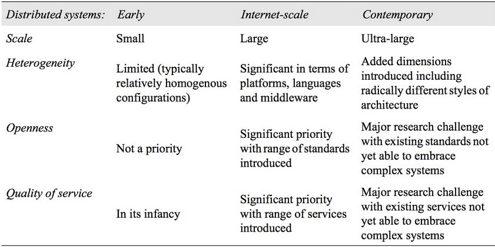

# Distributed Systems

### Representing DS
* `Physical Models`: In terms of devices
* `Architectural Models`: In terms of computational and communicational tasks performed by the system
0* `Fundamental models`: an abstract perspective in order to examine individual aspects of a `distributed system`. Three important aspects of distributed systems: `interaction models`, which consider the `structure` and `sequencing` of the `communication between the elements` of the system; `failure models`, which consider the `ways in which a system may fail` to operate correctly and; `security models`, which consider `how the system is protected` against attempts to interfere with its correct operation or to steal its data.

### Physical Models
* `baseline models`: minimal physical model of a distributed system as an extensible set of computer nodes interconnected by a computer network for the required passing of messages.
* `Early distributed systems`: Such systems emerged in the late 1970s and early 1980s in response to the emergence of LAN technology, usually Ethernet. These systems typically consisted of between 10 and 100 nodes interconnected by a LAN.
* `Internet-scale distributed systems`: Building on this foundation, larger-scale distributed systems started to emerge in the 1990s in response to the dramatic growth of the Internet during this time (for example, the Google search engine was first launched in 1996).  
The level of heterogeneity in such systems is significant in terms of networks, computer architecture, operating systems, languages employed and the development teams involved. This has led to an increasing emphasis on open standards and associated middleware technologies such as `CORBA` and more recently, `web services`. Additional services were employed to provide `end-to-end quality of service` properties in such global system.
* `Contemporary distributed systems`: physical architecture with a significant increase in the level of heterogeneity embracing, for example, the tiniest embedded devices utilized in ubiquitous computing through to complex computational elements found in `Grid computing`. These systems deploy an increasingly varied set of networking technologies and offer a wide variety of applications and services. Such systems potentially involve up to hundreds of thousands of nodes.

### Architectural Models
Structure in terms of separately specified `components` and their `interrelationships`. Major concerns are to make the system `reliable`, `manageable`, `adaptable` and `cost-effective`. The architectural design of a building has similar aspects – it determines not only its appearance but also its general structure and architectural style (gothic, neo-classic, modernist...).  
In this table you can see the characteristics of the three generations of distributed systems:
  

#### Architectural Elements
What are the elements composing a model and how this elements communicate?  
The entities that communicate in a DS are typically `processes`, giving name to the field of `inter-process communication`. There are **two** exceptions: `sensors` which do not have a process abstraction (in this case we consider them nodes) and in moders DS, `threads` are used more often than processes.  
From a programming perspective, this classification is not enough and some other elements are introduced:
* `Objects`: introduced to enable and encourage the use of `object-oriented approaches` in distributed. In distributed object-based approaches, `Objects` are accessed via `interfaces`, with an associated `interface definition language (or IDL)` providing a specification of the methods defined on an object.
* `Components`: component technology has emerged as a direct response to Object approach weaknesses. `Components` resemble objects in that they offer problem-oriented abstractions for building distributed systems and are **also accessed through interfaces**. The key difference is that **components specify not only their (provided) interfaces but also the assumptions they make in terms of other components/interfaces**, making all dependencies explicit and providing a more complete contract for system construction.
* `Web services`: the third important paradigm for the development of distributed systems. Web services are closely related to objects and components, again taking an approach based on `encapsulation of behaviour` and `access through interfaces`. In contrast, however, web services are `intrinsically integrated into the World Wide Web`, using web standards to represent and discover services.